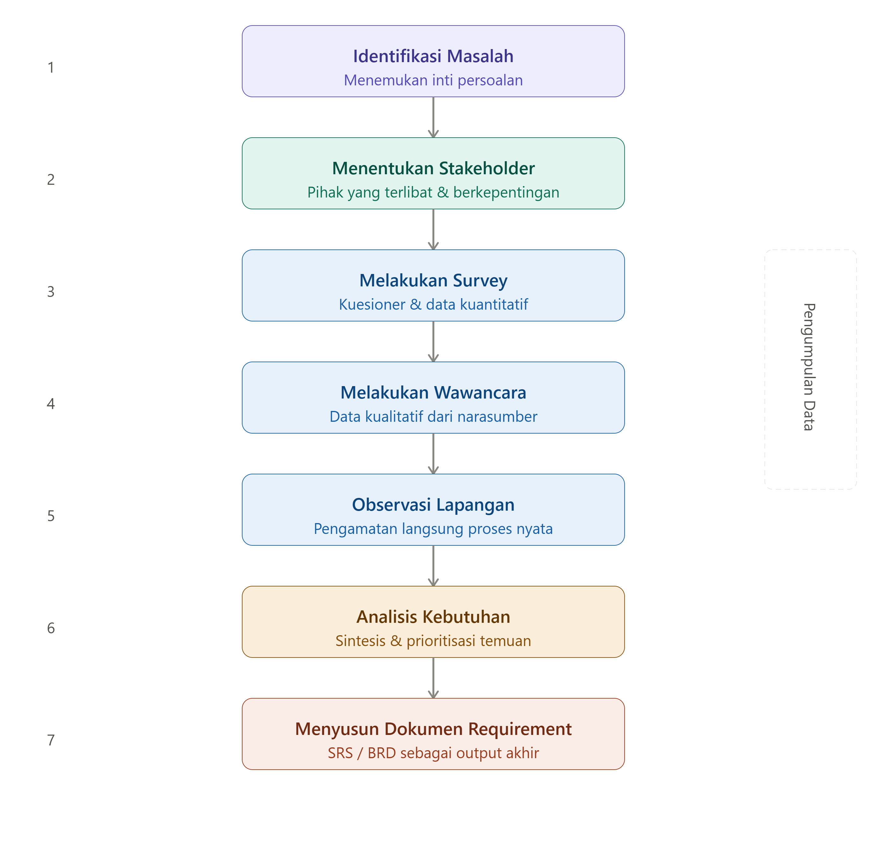

# Survey dan Research Kebutuhan Aplikasi Web

## Kompetensi Dasar

Setelah mempelajari materi ini, peserta didik mampu:

- Memahami pentingnya survey dan research sebelum membuat aplikasi web.
- Mengidentifikasi stakeholder dalam suatu proyek.
- Menyusun daftar pertanyaan untuk menggali kebutuhan pengguna.
- Menganalisis hasil survey menjadi kebutuhan sistem.
- Menyusun dokumen kebutuhan aplikasi (Requirement Specification) sederhana.

---

# Pendahuluan

Sebelum coding, seorang **Web Developer** harus memahami apa yang sebenarnya dibutuhkan oleh pengguna.

Banyak proyek gagal bukan karena programmer tidak bisa membuat aplikasi, tetapi karena aplikasi yang dibuat **tidak sesuai kebutuhan pengguna**.

Tahapan mencari kebutuhan aplikasi disebut **Requirements Gathering** atau **Requirements Engineering**. Tahap ini mencakup aktivitas mengumpulkan, menganalisis, memvalidasi, dan mendokumentasikan kebutuhan sistem secara terstruktur.

---

# Tujuan Survey dan Research

Survey dilakukan untuk mengetahui:

- Masalah yang dialami pengguna
- Proses bisnis yang sedang berjalan
- Solusi yang diharapkan
- Data yang akan diolah
- Hak akses pengguna
- Laporan yang dibutuhkan
- Infrastruktur yang tersedia

Tanpa survey yang baik, aplikasi berpotensi mengalami:

- Salah fitur
- Revisi berkali-kali
- Pembengkakan biaya
- Proyek terlambat selesai

---

# Alur Research



---

# Tahap 1 - Identifikasi Masalah

Pertanyaan yang harus dijawab:

- Masalah apa yang terjadi?
- Mengapa aplikasi dibutuhkan?
- Siapa yang mengalami masalah tersebut?
- Bagaimana proses kerja saat ini?

Contoh

Sebuah toko masih mencatat transaksi menggunakan buku.

Masalah:

- Data sering hilang
- Sulit mencari transaksi
- Laporan dibuat manual
- Banyak kesalahan pencatatan

---

# Tahap 2 - Menentukan Stakeholder

Stakeholder adalah pihak yang terlibat dalam penggunaan aplikasi.

Contoh:

| Stakeholder | Peran |
|-------------|-------|
| Owner | Menentukan kebutuhan bisnis |
| Admin | Mengelola data |
| Kasir | Input transaksi |
| Gudang | Mengelola stok |
| Pelanggan | Melakukan pembelian |

---

# Tahap 3 - Survey

Survey digunakan untuk memperoleh gambaran umum kebutuhan pengguna.

Survey dapat dilakukan menggunakan:

- Google Form
- Kuesioner
- Form cetak

Pertanyaan sebaiknya menggunakan:

- Pilihan Ganda

- Skala 1-5

- Jawaban singkat

- Essay

---

# Contoh Survey

## Pertanyaan

```text

1. Bagaimana proses kerja saat ini?

- Mudah

- Cukup

- Sulit


2. Apakah saat ini masih menggunakan Excel?

- Ya

- Tidak


3. Berapa banyak transaksi setiap hari?

- <10
- 10-50
- >50


4. Apa kendala terbesar?

......


5. Fitur apa yang paling dibutuhkan?

......

```

# Tahap 4 - Wawancara

Survey memberikan gambaran umum, sedangkan wawancara menggali kebutuhan secara lebih mendalam.

Beberapa teknik yang umum digunakan adalah wawancara, workshop, observasi, dan pembuatan prototipe awal untuk memvalidasi kebutuhan pengguna. :contentReference[oaicite:1]{index=1}

Contoh pertanyaan:

## Tentang Bisnis

Apa tujuan aplikasi dibuat?

Masalah apa yang ingin diselesaikan?

Siapa pengguna aplikasi?

---

## Tentang Data

Data apa saja yang disimpan?

Apakah ada upload file?

Apakah data boleh dihapus?

---

## Tentang User

Berapa jumlah pengguna?

Apakah ada level akses?

Admin?

Operator?

Manager?

Owner?

---

## Tentang Laporan

Laporan apa yang dibutuhkan?

Apakah perlu export PDF?

Apakah perlu export Excel?

---

## Tentang Keamanan

Apakah wajib login?

Apakah password harus terenkripsi?

Apakah diperlukan audit aktivitas pengguna?

---

## Tentang Server

Server berada dimana?

Cloud?

VPS?

Hosting?

Server kantor?

Apakah membutuhkan backup otomatis?

Bagaimana jika internet mati?

---

# Tahap 5 - Observasi

Observasi dilakukan dengan melihat langsung proses kerja pengguna.

Yang diamati:

- Alur kerja
- Dokumen yang digunakan
- Form yang diisi
- Laporan
- Hambatan kerja

Catatan observasi sebaiknya dilengkapi dengan foto (jika diizinkan), alur proses, dan waktu yang dibutuhkan pada setiap aktivitas.

---

# Tahap 6 - Analisis Kebutuhan

Hasil survey kemudian dikelompokkan menjadi beberapa kategori.

## Functional Requirement

Fitur yang harus dimiliki sistem.

Contoh:

- Login
- CRUD Data
- Cetak Laporan
- Dashboard
- Export Excel
- Notifikasi

---

## Non Functional Requirement

Kebutuhan selain fitur.

Contoh:

- Aplikasi berjalan 24 jam
- Response kurang dari 3 detik
- Backup otomatis
- Responsive
- Aman
- Multi User

---

# Tahap 7 - User Story

User Story menjelaskan kebutuhan dari sudut pandang pengguna.

Contoh

Sebagai Admin

Saya ingin menambah data barang

Sehingga stok dapat diperbarui.

Contoh lain

Sebagai Owner

Saya ingin melihat laporan penjualan

Sehingga saya dapat mengetahui keuntungan setiap bulan.

---

# Tahap 8 - Use Case Sederhana

```text
Owner
   │
   ├── Login
   ├── Lihat Dashboard
   ├── Lihat Laporan

Admin
   │
   ├── Login
   ├── Kelola Barang
   ├── Kelola User
   ├── Cetak Laporan
```

---

# Tahap 9 - Menyusun Requirement

Contoh Requirement

## Menu Login

Fitur

- Login Username
- Password
- Logout

---

## Menu Barang

Fitur

- Tambah Barang
- Edit Barang
- Hapus Barang
- Cari Barang

---

## Menu Transaksi

Fitur

- Input Penjualan
- Cetak Struk
- Riwayat Transaksi

---

## Dashboard

Menampilkan

- Total Penjualan
- Barang Terjual
- Grafik Penjualan

---

# Contoh Dokumen Hasil Research

```
Nama Proyek

Sistem Informasi Penjualan

Permasalahan

Masih menggunakan buku.

Tujuan

Mempermudah transaksi.

User

Admin
Kasir
Owner

Fitur

Login
Master Barang
Transaksi
Laporan
Dashboard

Database

Barang
Kategori
Supplier
Transaksi
User

Server

Cloud VPS

Backup

Setiap hari pukul 23.00
```

---

# Tips Melakukan Survey

- Dengarkan kebutuhan pengguna sebelum menawarkan solusi.
- Hindari istilah teknis yang sulit dipahami.
- Catat semua hasil wawancara.
- Validasi kembali hasil diskusi kepada stakeholder.
- Fokus pada masalah bisnis, bukan hanya fitur yang diminta.
- Dokumentasikan seluruh hasil survey agar menjadi acuan selama pengembangan.

---

# Rangkuman

Tahapan survey sebelum membuat aplikasi web:

1. Identifikasi masalah
2. Menentukan stakeholder
3. Menyusun survey
4. Melakukan wawancara
5. Observasi proses bisnis
6. Analisis kebutuhan
7. Menyusun User Story
8. Membuat Use Case
9. Menyusun Requirement Specification
10. Mendapatkan persetujuan stakeholder

Dengan melakukan research yang baik, pengembang dapat membuat aplikasi yang sesuai kebutuhan pengguna, mengurangi revisi, dan meningkatkan peluang keberhasilan proyek.

---

# Latihan

## Praktik 1

Pilih salah satu studi kasus berikut:

- Sistem Perpustakaan
- Sistem Kasir
- Sistem Absensi
- Sistem Inventaris Sekolah

Buat daftar minimal **20 pertanyaan survey** yang akan diajukan kepada calon pengguna.

---

## Praktik 2

Lakukan wawancara kepada guru, teman, atau pelaku usaha kecil mengenai kebutuhan aplikasi.

Dokumentasikan:

- Permasalahan
- Stakeholder
- Alur proses bisnis
- Functional Requirement
- Non Functional Requirement

---

## Tugas Akhir

Buat dokumen hasil research untuk sebuah aplikasi web pilihan Anda yang berisi:

- Latar Belakang
- Tujuan Sistem
- Stakeholder
- Hasil Survey
- Hasil Wawancara
- Analisis Kebutuhan
- User Story
- Use Case
- Daftar Fitur
- Kesimpulan