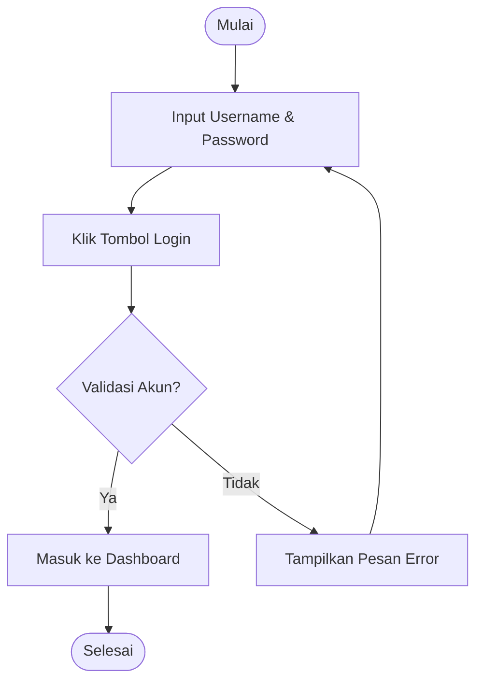
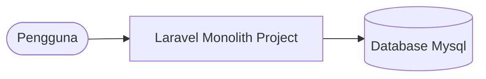
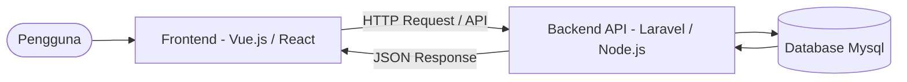

# Perancangan Web: Menyusun PRD, Requirements, dan User Flow

## Kompetensi Dasar

Setelah mempelajari materi ini, peserta didik mampu:

- Memahami konsep perancangan aplikasi web setelah tahap research.
- Menyusun dokumen kebutuhan produk (**Product Requirement Document / PRD**) sederhana.
- Mengidentifikasi dan menuliskan **Functional** dan **Non-Functional Requirements**.
- Merancang alur pengguna (**User Flow**) menggunakan simbol-simbol standar.
- Merancang struktur menu aplikasi menggunakan **Sitemap**.
- Memahami konsep arsitektur aplikasi web (Monolith & Client-Server).
- Merancang struktur database relasional sederhana.
- Merancang dokumentasi RESTful API endpoint.

---

# Pendahuluan

Setelah melakukan *Survey dan Research* (di [Pertemuan 2-3](../Pertemuan%202-3/3.%20Research.md)), kita mendapatkan banyak data mentah berupa masalah pengguna, keinginan owner, dan proses bisnis saat ini. 

Data mentah tersebut tidak bisa langsung diserahkan kepada programmer untuk dicoding. Kita harus menerjemahkannya terlebih dahulu ke dalam dokumen perencanaan dan diagram alur sistem yang jelas. Tahap inilah yang disebut **Perancangan Web (Web Design/Planning)**.

Ada beberapa pilar utama dalam tahap awal perancangan ini:
1. **PRD (Product Requirement Document)**: Dokumen panduan proyek.
2. **Requirements**: Detail fitur dan spesifikasi teknis.
3. **User Flow & Sitemap**: Visualisasi alur navigasi dan struktur halaman.
4. **Architecture & Database**: Menentukan arsitektur sistem (Monolith/Client-Server) dan struktur tabel (ERD/Skema).
5. **API Documentation**: Menentukan endpoint komunikasi data antara frontend dan backend.

---

# 1. Product Requirement Document (PRD)

**PRD** adalah dokumen tertulis yang menjelaskan fungsi, tujuan, fitur, dan perilaku dari produk yang akan dibuat. Dokumen ini menjadi acuan utama bagi seluruh anggota tim (Project Manager, UI/UX Designer, Programmer, QA).

### Struktur PRD Sederhana:
1. **Product Overview (Ringkasan Produk)**: Penjelasan umum tentang aplikasi.
2. **Objectives (Tujuan)**: Apa yang ingin dicapai dengan membuat aplikasi ini.
3. **User Persona (Target Pengguna)**: Profil pengguna yang akan berinteraksi dengan sistem.
4. **Scope of Features (Cakupan Fitur)**: Daftar menu atau halaman utama.
5. **Non-Functional Requirements**: Kebutuhan performa, keamanan, dan platform.
6. **Release Criteria & Testing**: Cara menguji aplikasi sebelum dirilis.

> [!NOTE]
> PRD membantu menghindari *scope creep* (fitur tambahan liar di tengah jalan yang membuat proyek tidak selesai-selesai).

---

# 2. Spesifikasi Kebutuhan (Requirements)

Requirements dibagi menjadi dua kelompok utama:

### A. Functional Requirements (Kebutuhan Fungsional)
Menjelaskan **apa** yang dapat dilakukan oleh sistem (fitur/proses bisnis).

*Contoh pada Sistem Informasi Perpustakaan:*
- Sistem harus dapat memvalidasi password admin saat login.
- Sistem harus dapat menampilkan daftar buku yang tersedia.
- Sistem harus dapat mencetak kartu bukti peminjaman dalam format PDF.

### B. Non-Functional Requirements (Kebutuhan Non-Fungsional)
Menjelaskan **bagaimana** sistem harus berperilaku (kriteria kualitas dan batasan teknis).

*Contoh:*
- **Performa**: Waktu muat halaman pertama tidak boleh lebih dari 3 detik.
- **Keamanan**: Password pengguna wajib di-enkripsi menggunakan Bcrypt.
- **Responsiveness**: Tampilan web harus menyesuaikan layar smartphone dan desktop.
- **Ketersediaan**: Sistem dapat diakses 24 jam sehari dengan uptime minimal 99%.

---

# 3. User Flow (Alur Pengguna)

**User Flow** adalah diagram alur yang menggambarkan langkah-langkah yang dilalui oleh pengguna dalam aplikasi untuk menyelesaikan suatu tugas tertentu (misal: memesan barang, melakukan login, atau mendaftar akun).

### Simbol Dasar User Flow:

| Simbol | Nama Simbol | Fungsi |
|:---:|:---|:---|
| 🟢 | **Terminal (Oval)** | Menunjukkan titik **Mulai (Start)** dan **Selesai (End)**. |
| 🟦 | **Process (Persegi Panjang)** | Menunjukkan aksi, proses, atau langkah kerja (misal: "Isi form", "Klik login"). |
| 🔶 | **Decision (Belah Ketupat)** | Menunjukkan pilihan/percabangan logika (misal: "Apakah password benar?"). |
| ➡️ | **Arrow (Panah)** | Menunjukkan arah aliran proses. |

### Contoh Alur Logika User Flow (Login):



---

# 4. Sitemap (Peta Situs)

**Sitemap** adalah diagram hierarki yang menggambarkan struktur organisasi halaman-halaman dalam sebuah website. Sitemap membantu designer merancang susunan menu dan struktur informasi (Information Architecture).

### Contoh Sitemap (Sistem Inventaris Sekolah):

```text
Homepage (Landing Page)
│
├── Dashboard (Setelah Login)
│    ├── Menu Kelola Barang
│    │    ├── Tambah Barang
│    │    ├── Edit Barang
│    │    └── Stok Opname
│    ├── Menu Peminjaman
│    │    ├── Form Pinjam Alat
│    │    └── Daftar Peminjam Aktif
│    └── Menu Laporan
│         ├── Laporan Bulanan
│         └── Export Excel/PDF
│
└── Halaman Kontak & Bantuan
```

---

# 5. Wireframe (Coretan Kasar)

Setelah PRD, User Flow, dan Sitemap disepakati, barulah designer membuat **Wireframe**.
Wireframe adalah sketsa hitam-putih (low-fidelity) yang menunjukkan tata letak (*layout*) tombol, teks, dan gambar pada layar sebelum diwarnai dan diberi efek grafis yang indah di Figma.

---

# 6. Arsitektur Aplikasi (Architecture)

Arsitektur aplikasi adalah struktur sistem yang mendefinisikan bagaimana bagian-bagian dari aplikasi saling berinteraksi. Untuk aplikasi web modern, terdapat dua jenis arsitektur yang paling umum diajarkan:

### A. Arsitektur Monolith (Tradisional)
Seluruh komponen aplikasi (Frontend, Backend, dan Database) berada di dalam satu server/aplikasi yang sama. 
- *Contoh*: Aplikasi Laravel standar di mana router, controller, database query, dan file HTML (Blade) dikelola dalam satu folder project.



### B. Arsitektur Client-Server / Decoupled (Modern) kita pakai ini
Frontend (UI yang berjalan di browser pengguna) dipisahkan sepenuhnya dari Backend (logika bisnis & database yang berjalan di server). Keduanya berkomunikasi menggunakan **API**.
- *Contoh*: Frontend dibuat menggunakan **Vue.js** atau **React**, sedangkan Backend dibuat menggunakan **Express.js (Node.js)** atau **Laravel API**.



---

# 7. Perancangan Database (Database Design)

Perancangan database bertujuan untuk menentukan bagaimana data dari aplikasi web kita disimpan secara terstruktur dan saling terhubung.

### Langkah Perancangan Database:
1. **Menentukan Entitas (Tabel)**: Apa saja objek data yang ingin disimpan (contoh: `users`, `products`, `orders`).
2. **Menentukan Atribut (Kolom & Tipe Data)**: Detail informasi dari entitas tersebut.
3. **Menentukan Relasi (Hubungan)**: Hubungan antar tabel (contoh: 1 user dapat melakukan banyak transaksi / *One-to-Many*).

### Contoh Skema Tabel Database Sederhana:

**Tabel `users` (Menyimpan data pengguna)**
| Nama Kolom | Tipe Data | Keterangan |
|:---|:---|:---|
| `id` | INT | Primary Key, Auto Increment |
| `username` | VARCHAR(50) | Unique |
| `password` | VARCHAR(255) | Enkripsi Hash |
| `role` | ENUM('admin', 'user') | Hak akses |

**Tabel `products` (Menyimpan data barang)**
| Nama Kolom | Tipe Data | Keterangan |
|:---|:---|:---|
| `id` | INT | Primary Key, Auto Increment |
| `name` | VARCHAR(100) | Nama barang |
| `price` | DECIMAL(10,2) | Harga barang |
| `stock` | INT | Jumlah stok |

---

# 8. Perancangan API (Application Programming Interface)

Jika aplikasi kita menggunakan arsitektur modern (Client-Server), kita wajib merancang **API Endpoint**. RESTful API adalah standar yang paling umum digunakan, memanfaatkan metode HTTP standar:

### HTTP Methods Utama:
- `GET` : Digunakan untuk membaca/mengambil data dari database.
- `POST` : Digunakan untuk membuat/menyimpan data baru.
- `PUT` / `PATCH` : Digunakan untuk mengedit/memperbarui data yang sudah ada.
- `DELETE` : Digunakan untuk menghapus data.

### Contoh Rancangan RESTful API Endpoint (Produk):

| HTTP Method | URL Endpoint | Deskripsi Fungsi | Request Body (JSON) |
|:---:|:---|:---|:---|
| **GET** | `/api/products` | Mengambil seluruh data barang | - |
| **GET** | `/api/products/{id}` | Mengambil detail 1 barang | - |
| **POST** | `/api/products` | Menambah barang baru | `{ "name": "Kabel UTP", "price": 50000, "stock": 10 }` |
| **PUT** | `/api/products/{id}` | Memperbarui data barang | `{ "name": "Kabel UTP Cat6", "price": 55000 }` |
| **DELETE** | `/api/products/{id}` | Menghapus barang | - |

---

# Rangkuman Alur Kerja Perancangan

Setelah melakukan survey, langkah sistematis perancangan web adalah:
1. **Menyusun PRD**: Menentukan tujuan, batasan, dan ruang lingkup produk.
2. **Menyusun Requirements**: Menulis spesifikasi fungsional & non-fungsional.
3. **Menggambar User Flow & Sitemap**: Merancang alur interaksi dan hierarki halaman.
4. **Merancang Arsitektur & Database**: Menentukan arsitektur sistem (Monolith/Client-Server) dan struktur tabel (ERD/Skema).
5. **Merancang API**: Menentukan endpoint komunikasi data antara frontend dan backend.
6. **Membuat Wireframe**: Membuat tata letak kasar sebagai kerangka dasar sebelum masuk ke desain visual visual/Figma.

---

# Tugas
Setelah mempelajari materi ini, kerjakan jobsheet berikut secara berkelompok:

[Link Tugas Perancangan: 4. jobsheet.md](4.jobsheet.md)

---

[Kembali ke Materi Sebelumnya: 3. Research.md](../Pertemuan%202-3/3.%20Research.md)

