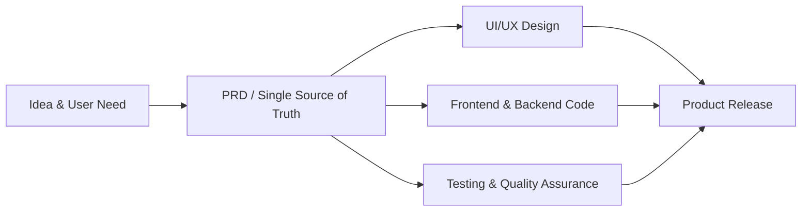
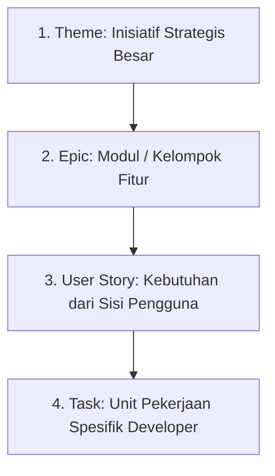
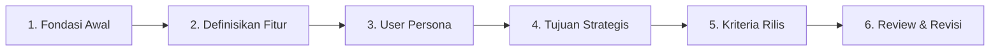

# Materi Perancangan Web: Menyusun Product Requirements Document (PRD)

> **Referensi Utama:** [How To Create a Product Requirements Document | Figma](https://www.figma.com/resource-library/product-requirements-document/)

---

## Tujuan Pembelajaran

Setelah mempelajari materi ini, peserta didik mampu:
1. Memahami konsep dasar **Product Requirements Document (PRD)** sebagai *single source of truth* dalam pengembangan aplikasi web.
2. Membedakan PRD dengan dokumen produk lainnya seperti **MRD**, **BRD**, dan **Tech Spec/Functional Spec**.
3. Memahami penerapan PRD pada tim kerja berbasis **Agile** (Themes, Epics, User Stories, Tasks).
4. Menerapkan **6 Langkah Utama Penyusunan PRD** standar Figma yang simpel dan terstruktur.
5. Menyusun draf dokumen PRD sederhana untuk proyek aplikasi web secara kelompok.

---

# 1. Apa Itu Product Requirements Document (PRD)?

Menurut panduan industri dari **Figma**, **PRD (Product Requirements Document)** adalah dokumen acuan utama (*single source of truth*) yang menjelaskan **APA (what)** yang akan dibangun dan **MENGAPA (why)** produk tersebut dibuat.

PRD bertindak sebagai kompas yang mengarahkan seluruh anggota tim—mulai dari *Product Manager*, *UI/UX Designer*, *Web Developer/Programmer*, hingga *Quality Assurance (QA)*—agar tetap memiliki pemahaman yang sama sepanjang siklus pengembangan aplikasi.



### Mengapa PRD Sangat Important?
- **Fokus & Kejelasan:** Mencegah tim tersesat atau salah paham terhadap fungsi utama web yang sedang dibangun.
- **Menghindari *Scope Creep*:** Mencegah bertambahnya fitur-fitur baru "liar" di tengah jalan yang membuat pengerjaan proyek menjadi molor dan tidak selesai.
- **Efisiensi Kerja:** Designer tahu apa yang harus di-desain, Programmer tahu logika apa yang harus di-koding, dan Tester tahu apa yang harus diuji.

---

# 2. Perbandingan PRD dengan Dokumen Produk Lainnya

Dalam industri pengembang lunak, sering kali terdapat beberapa jenis dokumen perencanaan. Penting untuk membedakan peran masing-masing dokumen agar tidak tertukar:

| Jenis Dokumen | Fokus Utama | Pertanyaan Kunci | Siapa yang Menulis? |
| :--- | :--- | :--- | :--- |
| **BRD** *(Business Requirements Document)* | Tujuan bisnis, dampak finansial, ROI, dan efisiensi operasional. | *Apakah proyek ini menguntungkan atau mendukung tujuan bisnis?* | Business Analyst / Management |
| **MRD** *(Market Requirements Document)* | Kebutuhan pasar, analisis kompetitor, dan peluang pelanggan eksternal. | *Siapa target pasar kita dan apa masalah yang mereka hadapi?* | Product Marketing Manager |
| **PRD** *(Product Requirements Document)* | Kebutuhan produk, fitur fungsional, dan pengalaman pengguna (*user experience*). | *Produk/fitur apa yang dibangun untuk menyelesaikan masalah tersebut?* | Product Manager / Project Leader |
| **Tech Spec / Functional Spec** | Spesifikasi teknis, arsitektur database, algoritma, dan alur API secara terperinci. | *Bagaimana engineer/programmer mengimplementasikannya secara teknis?* | Tech Lead / System Architect |

>  **Prinsip Penting:** PRD berfokus pada **APA** yang dibuat dan **MENGAPA** dibuat, sedangkan **Tech Spec** berfokus pada **BAGAIΜΑNA** cara koding/teknis mengimplementasikannya.

---

# 3. PRD dalam Metode Pengembangan Agile

Pada metode tradisional (Waterfall), PRD dibuat sangat tebal dan kaku di awal proyek. Namun pada metodologi **Agile**, PRD dibuat lebih **fleksibel, simpel, dan terus diperbarui (*living document*)**.

Dalam PRD berbasis Agile, kebutuhan proyek diurai ke dalam 4 tingkatan hirarki:



### Penjelasan Hirarki Agile:
1. **Theme:** Inisiatif besar atau arah strategis proyek (Contoh: *"Modernisasi Sistem Transaksi Kantin Sekolah"*).
2. **Epic:** Modul utama tempat menggabungkan beberapa fitur terkait (Contoh: *"Sistem Pembayaran Digital / E-Wallet Kantin"*).
3. **User Story:** Pernyataan kebutuhan produk dari sudut pandang pengguna.
   - **Format Standar User Story:**
     > **As a** `[jenis pengguna]`, **I want to** `[melakukan aksi/tugas]`, **so that** `[mencapai tujuan/manfaat]`.
   - *Contoh:* *"Sebagai **siswa**, saya ingin **membeli makanan menggunakan scan QR Code**, agar **saya tidak perlu mengantre lama saat jam istirahat**."*
4. **Task:** Rincian langkah teknis yang dikerjakan oleh developer (Contoh: *"Buat API endpoint `/api/pay-qr` dan integrasikan library library kamera QR scanner"*).

---

# 4. 6 Langkah Menyusun PRD yang Simpel (Framework Figma)

Berdasarkan panduan Figma, berikut 6 langkah praktis untuk menyusun PRD yang efektif dan simpel:



### Langkah 1: Lay the Groundwork (Meletakkan Fondasi Proyek)
Tentukan informasi dasar proyek sebelum masuk ke detail teknis:
- **Elevator Pitch:** Ringkasan singkat proyek dalam 1–2 kalimat.
- **Tim & Stakeholder:** Siapa Project Manager, Designer, Developer, dan Penguji.
- **Jadwal & Anggaran:** Target tanggal rilis (MVP) dan batasan sumber daya.
- **Potensi Risiko:** Kendala atau risiko yang mungkin menghambat rilis (misal: koneksi internet sekolah lambat).

### Langkah 2: Define Your Features (Mendefinisikan Fitur Utama)
Buat daftar fitur yang dibutuhkan dan kelompokkan berdasarkan prioritas.
- Gunakan metode prioritas seperti **MoSCoW**:
  - **Must Have:** Fitur wajib (jika tidak ada, aplikasi gagal berjalan).
  - **Should Have:** Fitur penting tapi masih bisa ditunda jika waktu terdesak.
  - **Could Have:** Fitur tambahan (*nice to have*).
  - **Won't Have (MVP):** Fitur yang dipastikan **tidak** dibuat pada rilis versi awal.

### Langkah 3: Write User Personas (Profil Pengguna Target)
Jelaskan siapa yang akan menggunakan aplikasi ini:
- Nama perwakilan persona, peran/profesi.
- Kebutuhan utama dan kendala/masalah (*pain points*) yang mereka alami.

### Langkah 4: Contextualize Strategic Goals (Hubungkan dengan Tujuan Strategis)
Jelaskan mengapa proyek/fitur ini bernilai bagi organisasi atau pengguna:
- Nilai tambah apa yang didapat pengguna?
- Indikator keberhasilan apa yang ingin dicapai (misal: memangkas waktu transaksi dari 5 menit menjadi 30 detik)?

### Langkah 5: Create Release Criteria (Menetapkan Kriteria Rilis / Definition of Done)
Tentukan kapan aplikasi dianggap siap rilis (*launch ready*):
- **Performa:** Waktu muat halaman web < 2 detik.
- **Responsif:** Tampilan rapi saat diakses lewat HP (smartphone) dan Komputer (desktop).
- **Pengujian:** Bebas dari bug kritis pada fungsi utama (login, transaksi, simpan data).

### Langkah 6: Review and Revise (Uji & Perbarui Berkelanjutan)
PRD bukan dokumen sekali tulis lalu dilupakan. PRD harus ditinjau bersama tim (designer, developer, stakeholder) dan terus disesuaikan jika terjadi perubahan kebutuhan di lapangan.

---

# 5. Template PRD Sederhana untuk Proyek Web (Standar SMK)

Gunakan format ringkas dan praktis berikut untuk menyusun PRD proyek web kalian:

```markdown
# Product Requirements Document (PRD)
## Nama Aplikasi / Proyek Web

**Versi:** 1.0  
**Tanggal:** [DD Bulan YYYY]  
**Status:** Draft / Approved  
**Tim Proyek:**  
- Product Owner / PM : [Nama]  
- UI/UX Designer     : [Nama]  
- Web Developer      : [Nama]  

---

### 1. Ringkasan & Tujuan Proyek (Overview & Objectives)
- **Ringkasan:** [Penjelasan singkat 1-2 kalimat tentang web yang dibuat]
- **Tujuan:** [Apa yang ingin dicapai]
- **Latar Belakang / Masalah:** [Masalah apa yang sedang diselesaikan]

### 2. User Persona (Target Pengguna)
- **Persona:** [Misal: Siswa / Guru / Admin / Kasir]
- **Masalah Utama:** [Kendala yang dihadapi saat ini]
- **Kebutuhan:** [Solusi yang diharapkan]

### 3. Kebutuhan Fitur (Feature Requirements)
| ID Fitur | Nama Fitur | Deskripsi & User Story | Prioritas (Must/Should/Could) |
| :--- | :--- | :--- | :--- |
| F-01 | Login Akun | As a User, I want to login so that... | Must |
| F-02 | Dashboard | As a User, I want to see summary... | Must |

### 4. Batasan Ruang Lingkup (Scope Limits / MVP)
- **Termasuk dalam MVP:** [Fitur yang masuk di versi awal]
- **TIDAK Termasuk (Future Scope):** [Fitur yang ditunda ke versi berikutnya]

### 5. Kebutuhan Non-Fungsional & Kriteria Rilis
- **Kecepatan:** Waktu muat halaman maksimal 3 detik.
- **Tampilan:** Responsif (Mobile & Desktop).
- **Keamanan:** Password di-hash / aman.
```

---

# 6. Contoh Nyata: PRD Web Kantin Digital Sekolah (*E-Kantin*)

Berikut adalah contoh penerapan PRD simpel menggunakan kasus proyek **Web E-Kantin SMK**:

```markdown
# Product Requirements Document (PRD)
## E-Kantin SMK — Web Pemesanan Makanan Pre-Order

**Versi:** 1.0  
**Tanggal:** 24 Agustus 2026  
**Status:** Approved  
**Tim Proyek:**  
- Product Owner : Budi (PM)  
- UI/UX Designer : Siti  
- Web Developer  : Ahmad & Rizky  

---

### 1. Ringkasan & Tujuan Proyek
- **Ringkasan:** Web pemesanan makanan kantin sekolah secara pre-order agar siswa tidak perlu mengantre saat jam istirahat.
- **Tujuan:** Memangkas waktu antrean jam istirahat dari 15 menit menjadi kurang dari 2 menit.
- **Masalah:** Waktu istirahat sekolah hanya 30 menit. Siswa sering kehabisan waktu istirahat hanya untuk mengantre makanan di kantin.

### 2. User Persona
- **Nama Persona:** Andi (Siswa Kelas XI TJKT)
- **Karakter:** Memiliki smartphone, ingin cepat makan saat jam istirahat agar bisa segera lanjut aktivitas/diskusi.
- **Kebutuhan:** Bisa memesan makanan pada jam pelajaran pertama dan tinggal mengambil pesanan saat bel istirahat berbunyi.

### 3. Kebutuhan Fitur (User Stories & Prioritas)
| ID | Fitur | User Story | Prioritas |
| :--- | :--- | :--- | :--- |
| F-01 | Katalog Menu | As a Student, I want to view daily menu with prices so that I can choose my meal. | Must |
| F-02 | Form Pre-Order | As a Student, I want to place an order for recess time so that my food is ready on time. | Must |
| F-03 | Dashboard Stand Kantin | As a Merchant/Seller, I want to see list of incoming orders so that I can prepare meals in advance. | Must |
| F-04 | Status Pesanan | As a Student, I want to see if my order is 'Preparing' or 'Ready' so that I know when to pick it up. | Should |

### 4. Batasan Ruang Lingkup (MVP)
- **Termasuk MVP:** Katalog menu, pemesanan sederhana (pembayaran tunai saat ambil), dashboard pesanan penjual.
- **Tidak Termasuk MVP:** Integrasi Payment Gateway (Midtrans/QRIS otomatis) dan sistem ulasan/rating makanan.

### 5. Kriteria Rilis (Release Criteria)
- Web dapat diakses lancar via smartphone dengan browser Chrome & Safari.
- Pengujian berhasil: 20 pemesanan bersamaan tanpa mengalami crash database.
```

---

#  Rangkuman & Kesimpulan

1. **PRD** adalah dokumen penuntun utama (*what* dan *why*) untuk membangun produk web agar tim terarah dan efisien.
2. **PRD berbeda dengan Tech Spec:** PRD berfokus pada kebutuhan produk dan pengguna, sedangkan Tech Spec berfokus pada detail teknis koding/infrastruktur.
3. PRD pada metode **Agile** diurai menjadi **Themes ➔ Epics ➔ User Stories ➔ Tasks**.
4. **6 Langkah Figma dalam menyusun PRD:**
   1. *Lay the groundwork* (Fondasi awal & tim).
   2. *Define your features* (Definisikan fitur & prioritas).
   3. *Write user personas* (Profil pengguna).
   4. *Contextualize strategic goals* (Kaitkan dengan tujuan strategis).
   5. *Create release criteria* (Kriteria rilis/MVP).
   6. *Review and revise* (Review & perbarui berkala).

---

#  Pertanyaan Diskusi & Evaluasi Singkat

1. Mengapa sebuah tim pengembang web disarankan membuat PRD terlebih dahulu sebelum memulai proses pembuatan desain UI dan pengodean (*coding*)?
2. Sebutkan perbedaan utama antara **User Story** dan **Task** dalam konsep PRD Agile!
3. Jika saat proses pembuatan web berlangsung pihak klien ingin menambah 5 fitur baru secara mendadak, bagaimana fungsi PRD dalam menangani situasi tersebut?
