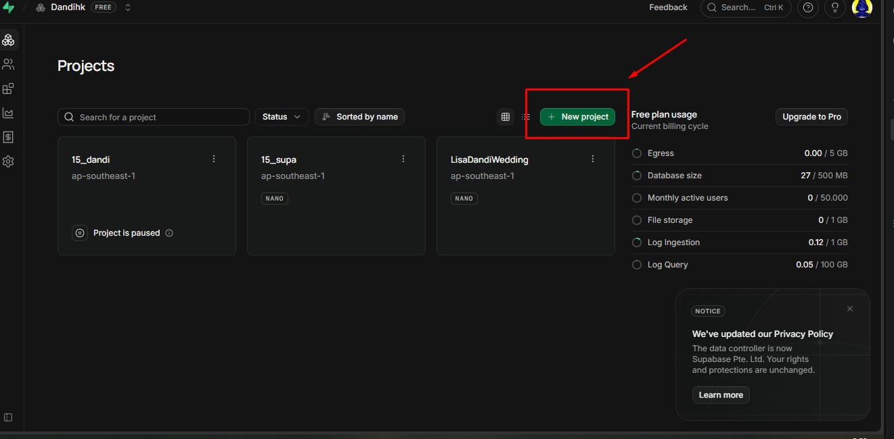
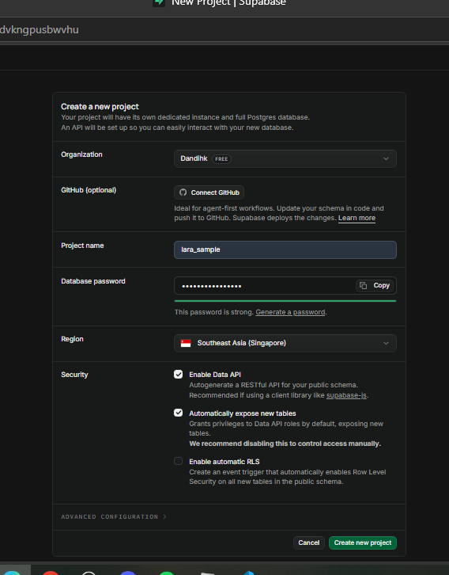
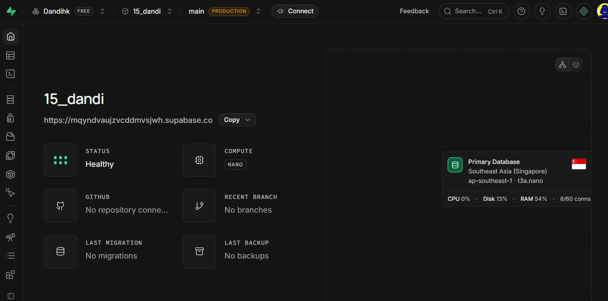
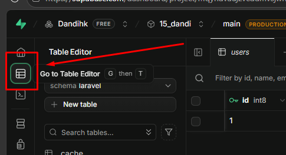
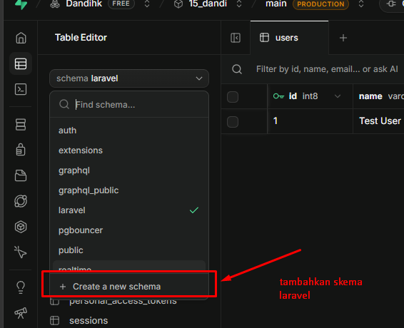
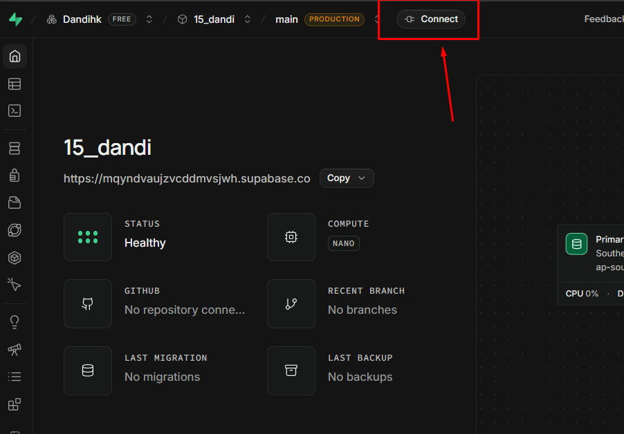
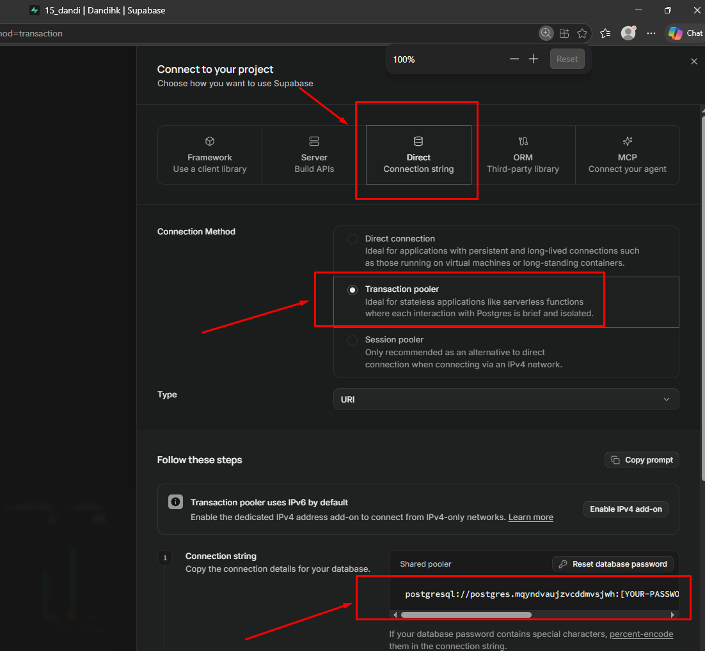
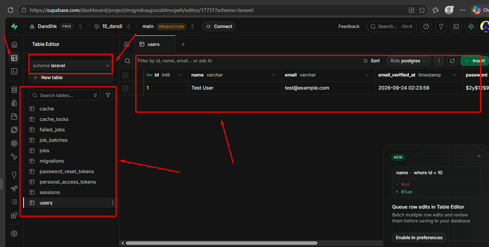

# Integrasi Supabase Database dengan Laravel

Supabase adalah platform backend-as-a-service yang berbasis PostgreSQL. Supabase menyediakan berbagai fitur seperti database, autentikasi, storage, real-time, dan REST API. Dalam pengembangan aplikasi web, Supabase dapat digunakan sebagai database utama yang terhubung ke Laravel.

Dengan Laravel, kita dapat mengelola data di Supabase layaknya database PostgreSQL biasa. Artinya, aplikasi Laravel tetap menggunakan model, migration, controller, dan query builder yang familiar, tetapi data disimpan di server Supabase.

---

## 2. Tujuan Pembelajaran

Setelah mempelajari materi ini, siswa diharapkan mampu:

- memahami konsep Supabase dan manfaatnya untuk aplikasi web;
- mengetahui cara menghubungkan Laravel dengan database Supabase;
- membuat konfigurasi koneksi database pada Laravel;
- menjalankan migration dan query ke database Supabase;
- memahami cara mengintegrasikan data aplikasi dengan backend berbasis cloud.

---

## 3. Mengapa Menggunakan Supabase?

Supabase populer karena:

- berbasis PostgreSQL yang reliabel dan scalable;
- mudah digunakan untuk developer;
- menyediakan dashboard visual untuk mengelola database;
- memiliki API otomatis dan dukungan real-time;
- cocok untuk kebutuhan aplikasi modern berbasis web dan mobile.

Dalam konteks pembelajaran, Supabase cocok digunakan karena proses setup lebih sederhana dibanding database server lokal.

---

## 5. Persiapan

Sebelum melakukan **integrasi**, pastikan beberapa hal berikut sudah tersedia:

- Laravel sudah terinstall di komputer.
- Akun Supabase sudah dibuat (bisa login dengan github).
- Project Supabase sudah dibuat.
- Database sudah aktif pada project tersebut.
- Koneksi internet tersedia.

---

## 6. Langkah-langkah Membuat Project Supabase

### 6.1. Membuat project baru di Supabase

1. Buka situs https://supabase.com
2. Login menggunakan akun GitHub.
3. Klik tombol New project.

4. Isi nama project, region, dan password database (simpan).

5. Tunggu proses provisioning database selesai. Setelah project berhasil dibuat, akan muncul dashboard Supabase yang berisi:

6. Buat skema baru 
    kenapa? Supabase mengekspos skema public sebagai API data. disarankan dan Secara default, Laravel menggunakan skema public jadi lebih baik dirubah
    
    

---

## 7. Mengambil Data Koneksi Database Supabase

1. Pada dashboard Supabase, masuk ke conect:
    - connect


2. Di sana akan ditemukan konfigurasi consection supabase:
    - conction metode

3. untuk mengkoneksikan dengan laravel, kita menggunkan **Direct Conection string** dan consction method **Transaction pooler** ambil **conection stringnya**


---

## 8. Konfigurasi Laravel untuk Menghubungkan Supabase

baca dokumentasi supabase laravel https://supabase.com/docs/guides/getting-started/quickstarts/laravel

1. Pada file `.env`, ubah konfigurasi database menjadi seperti berikut:

```env
DB_CONNECTION=pgsql
DB_HOST=**paste hasil copy dari conection string [yourpassword] rubah dengan "password mu"**

```
2. Pada file `config/database.php`, ubah **search_patch** untuk pgsql menjadi "laravel"

```php
'pgsql' => [
    'driver' => 'pgsql',
    'url' => env('DB_URL'),
    'host' => env('DB_HOST', '127.0.0.1'),
    'port' => env('DB_PORT', '5432'),
    'database' => env('DB_DATABASE', 'laravel'),
    'username' => env('DB_USERNAME', 'root'),
    'password' => env('DB_PASSWORD', ''),
    'charset' => env('DB_CHARSET', 'utf8'),
    'prefix' => '',
    'prefix_indexes' => true,
    'search_path' => 'laravel',
    'sslmode' => 'require',
],
```
3. Jalankan `php artisan migrate` dan `php artisan seed`

4. jika berhasil maka skema laravel berisi tabel hasil migration dan users berisi test user



## 9. Keuntungan Menggunakan Supabase dengan Laravel

Integrasi Laravel dengan Supabase memberikan beberapa keuntungan:

- database bisa diakses dari berbagai tempat;
- tidak perlu setup server PostgreSQL sendiri;
- proses backup dan monitoring lebih mudah;
- cocok untuk aplikasi yang membutuhkan data real-time;
- memudahkan kolaborasi tim karena database dikelola di cloud.

---

## 10. Kesimpulan

Integrasi Supabase dengan Laravel adalah solusi modern untuk membangun aplikasi web yang cepat, aman, dan scalable. Laravel tetap menjadi framework backend yang kuat, sedangkan Supabase menyediakan database PostgreSQL berbasis cloud yang mudah dikelola.

Dengan memahami konfigurasi `.env`, migration, model, dan query builder, kita dapat membangun aplikasi Laravel yang terhubung ke Supabase secara efektif.

---


## 11. Referensi

- https://supabase.com/docs
- https://laravel.com/docs
- Dokumentasi PostgreSQL

---
