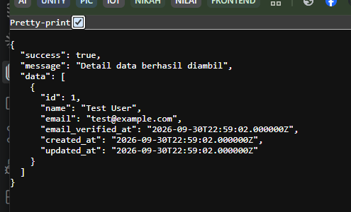

# API Resource Laravel

## 1. Pendahuluan

API Resource pada Laravel adalah fitur yang digunakan untuk membentuk format data JSON yang akan dikirimkan ke client. Fitur ini sangat berguna dalam pengembangan REST API karena memungkinkan kita mengubah data dari model ke struktur yang rapi dan konsisten sebelum dikirim ke frontend atau aplikasi mobile.

Dengan API Resource, kita tidak perlu menulis response JSON secara manual di setiap controller. Laravel menyediakan cara yang lebih terstruktur dan clean untuk membangun response API.

---

## 2. Tujuan Pembelajaran

Setelah mempelajari materi ini, siswa diharapkan mampu:

- memahami konsep API Resource di Laravel;
- membuat API Resource untuk model tertentu;
- mengubah data model menjadi format JSON yang rapi;
- mengintegrasikan API Resource di controller dan route;
- memahami manfaat API Resource dalam pengembangan API.

---

## 3. Install dan membuat API laravel 
1. jalankan perintah install api
```bash
php artisan install:API
```
2. Buat controller resource API
```bash
php artisan make:controller /api/nama_controler --api
```
3. membuat function get api (membaca semua data user) 
 - buka controller (`app/http/controller/api/...`)
 - panggil model user terlebih dahulu
```php
use App\Models\User;
```
 - di function index, panggil semua data user dan return ke json
```php
public function index()
    {
        $items = User::all();

        return response()->json([
            'success' => true,
            'message' => 'Detail data berhasil diambil',
            'data'    => $items
        ], 200);
    }
``` 
4. membuat jalan api untuk menjalankan function index
    - buka `Routes/API.php`
    - panggil controllernya
    ```php
    use App\Http\Controllers\API\nama_controller;
    ```
    - tambhakan routenya
    ```php
    Route::apiResource('/users', xxxController::class);
    ```

5. jalankan `php artisan serve` dan buka url localhost
    buka url `localhost:xxxx/api/users`
    

## 4. Referensi

- Laravel Documentation
- REST API Laravel
- Dokumentasi Laravel Resource

---

## 5. Penutup

Materi API Resource Laravel ini merupakan dasar penting sebelum mempelajari API yang lebih kompleks seperti authentication, validation, dan data relation. Dengan memahami konsep resource, siswa akan lebih siap membangun API yang bersih dan profesional.
