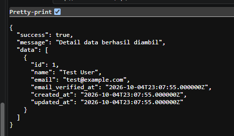

# Deploy API Laravel di Vercel

## 1. Pendahuluan

Vercel dikenal sebagai platform deployment untuk aplikasi frontend seperti Next.js, React, dan Vue. Namun, Vercel juga dapat digunakan untuk menyebarkan aplikasi backend ringan, termasuk API Laravel yang dibuat dalam bentuk serverless atau aplikasi PHP yang diatur dengan konfigurasi tertentu.

Pada materi ini, kita akan membahas bagaimana cara deploy API Laravel ke Vercel agar aplikasi backend bisa diakses secara online. Proses ini sangat cocok untuk pembelajaran full stack karena API dapat langsung dipakai oleh frontend yang sudah dipublish.

---

## 2. Tujuan Pembelajaran

Setelah mempelajari materi ini, siswa diharapkan mampu:

- memahami konsep deploy aplikasi Laravel ke Vercel;
- menyiapkan project Laravel untuk deployment;
- mengubah konfigurasi agar aplikasi Laravel bisa berjalan di Vercel;
- menghubungkan API Laravel dengan database cloud;
- memahami tantangan dan solusi saat deploy backend ke Vercel.

---

## 3. Apa itu Vercel?

Vercel adalah platform deployment berbasis cloud yang fokus pada kecepatan, kemudahan penggunaan, dan integrasi dengan GitHub. Vercel banyak digunakan untuk deploy aplikasi frontend modern, tetapi juga bisa digunakan untuk API kecil sampai aplikasi serverless.

Keunggulan Vercel:

- mudah digunakan;
- otomatis deploy saat repository di-push;
- gratis untuk project kecil;
- support integrasi GitHub dan environment variables;
- cocok untuk proyek pembelajaran dan prototype.

---

## 4. Kelebihan dan Keterbatasan Deploy Laravel di Vercel

### Kelebihan

- deployment cepat dan sederhana;
- otomatis melakukan build dan deploy;
- cocok untuk API yang tidak terlalu kompleks;
- mudah dihubungkan ke database cloud seperti Supabase.

### Keterbatasan

- Laravel asli adalah aplikasi PHP full-stack, bukan framework serverless native;
- beberapa fitur seperti queue, scheduler, worker, atau command cron tidak berjalan seperti di hosting biasa;
- konfigurasi untuk production perlu disesuaikan;
- database dan storage perlu dikelola secara terpisah.

Karena itu, deploy Laravel di Vercel biasanya cocok untuk API sederhana dan backend yang tidak terlalu membutuhkan proses background.

---

## 5. Persiapan Sebelum Deployment

Sebelum deploy, pastikan hal berikut sudah tersedia:

- project Laravel sudah dibuat;
- API sudah berjalan di local;
- database sudah siap, misalnya Supabase;
- akun GitHub sudah aktif;
- akun Vercel sudah dibuat;
- repository project sudah di-push ke GitHub.

---

## 7. Langkah-langkah Awal
pelajari https://rachmat-nur.gitbook.io/pw2/laravel/upload-laravel-ke-vercel-and-clever-cloud/github-dan-vercel

dan praktikan 

rubah 
```json
{
    "version": 2,
      "framework": null,
    "functions": {
        "api/index.php": { "runtime": "vercel-php@0.9.0" }
    },
    "routes": [
        
        {
            "src": "/(.*)",
            "dest": "/api/index.php"
        }
    ],
    "env": {
        "APP_ENV": "production",
        "APP_DEBUG": "true",
        "APP_URL": "",
 
        "APP_CONFIG_CACHE": "/tmp/config.php",
        "APP_EVENTS_CACHE": "/tmp/events.php",
        "APP_PACKAGES_CACHE": "/tmp/packages.php",
        "APP_ROUTES_CACHE": "/tmp/routes.php",
        "APP_SERVICES_CACHE": "/tmp/services.php",
        "VIEW_COMPILED_PATH": "/tmp",
 
        "CACHE_DRIVER": "array",
        "LOG_CHANNEL": "stderr",
        "SESSION_DRIVER": "cookie"
    }
}
```
- untuk menguji api 
    **`xxxx.vercel.app/api/api/users`**
    

## 17. Keuntungan Deploy Laravel di Vercel

- cepat dan praktis;
- cocok untuk prototyping dan project pembelajaran;
- integrasi dengan GitHub mudah;
- backend bisa digunakan oleh frontend yang sudah di-deploy.

---

## 18. Kesimpulan

Deploy API Laravel di Vercel merupakan cara modern untuk mempublikasikan backend aplikasi agar bisa diakses secara online. Meskipun Laravel adalah framework PHP yang biasanya berjalan pada server tradisional, dengan konfigurasi yang tepat kita tetap bisa menjalankannya di Vercel untuk kebutuhan API sederhana.

Dalam praktiknya, developer perlu memastikan file deploy, environment variables, dan koneksi database sudah siap agar aplikasi berjalan dengan baik di production.

---


## 20. Referensi

- https://vercel.com/docs
- https://laravel.com/docs
- Dokumentasi PHP dan framework deployment pada hosting serverless

---

## 21. Penutup

Materi ini memberikan gambaran dasar tentang bagaimana API Laravel dapat dideploy ke Vercel. Dengan latihan yang berulang, siswa akan lebih memahami proses deploy backend, konfigurasi environment, dan cara menjaga aplikasi agar dapat berjalan dengan stabil di lingkungan production.
